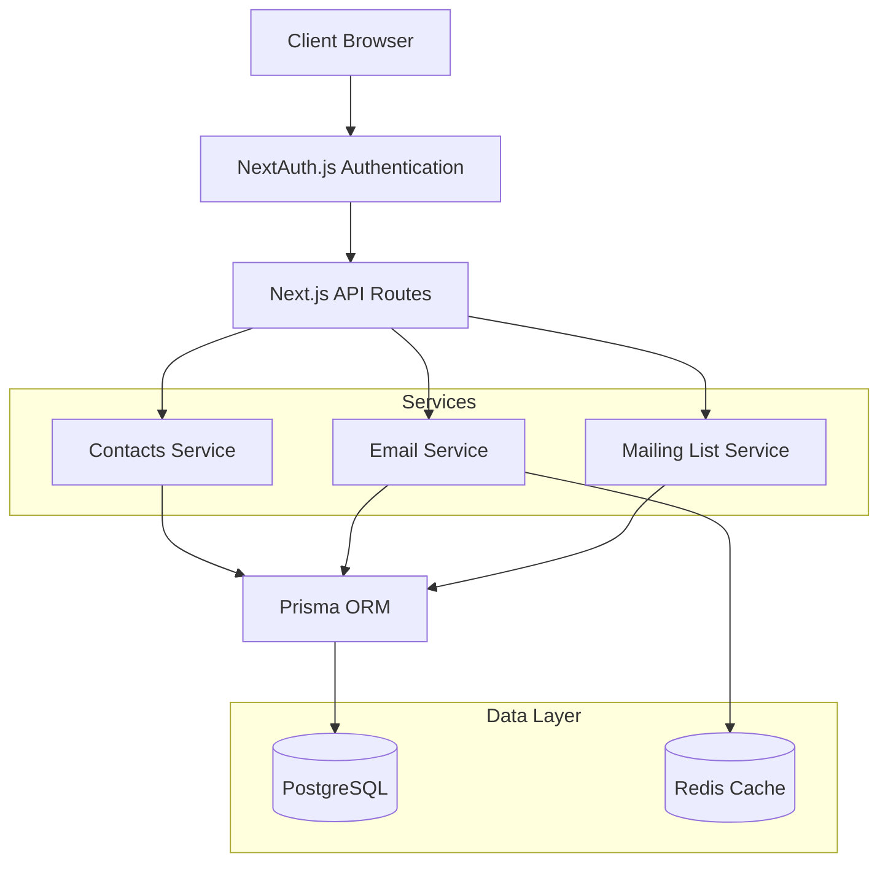

# Posthoot - the opensourced email marketing engine

 
  
<em>First-class email automation for modern enterprises</em>

## Overview

Posthoot is an enterprise-grade email orchestration platform that helps businesses automate their email workflows, manage contact lists, and deliver personalized communications at scale. Built with modern technologies and designed for performance.

## Latest Updates

🎉 **Version 1.1.0 Released!** - [See Changelog](CHANGELOG.md)

Major updates include:
- Custom Domain Support with automatic SSL
- Team Management & Collaboration
- Enhanced Security Features

## Architecture

## Core Features

### Contact Management
- **Contact Lists**
  - Create and manage multiple contact lists
  - Smart segmentation and filtering
  - Bulk contact import/export
  - Custom fields and attributes
  - Contact activity tracking

### Custom Domains
- 🌐 Custom Domain Support with A Record Verification
- 🔒 Automatic SSL Certificate Generation
- 🔄 DNS Management & Real-time Status
- ✅ One-click Domain Verification
- 🔐 Automated SSL Renewal

### Analytics & Reporting
- 📊 Real-time Email Tracking
- 📈 Performance Analytics Dashboard
- 📉 Trend Analysis & Insights
- 📋 CSV/JSON Report Generation
- 📱 Device & Location Analytics

### Team Management
- 👥 Multi-user Support
- 🔑 Role-based Access Control
- 📨 Team Invitations
- 🎨 Custom Branding
- 🏢 Organization Settings

### Security & Compliance
- 🔒 SSL/TLS Encryption
- 🔐 API Key Management
- 📝 Audit Logs
- 🔑 Two-factor Authentication
- 🛡️ Rate Limiting

## Tech Stack

- **Frontend**: Next.js 14, React, Tailwind CSS, shadcn/ui
- **Backend**: Node.js, PostgreSQL, Redis
- **Infrastructure**: Docker, Nginx, OpenResty
- **Email**: SMTP, Custom Domain Support
- **Security**: Let's Encrypt, SSL/TLS

## Getting Started

### Prerequisites

- Node.js 20 or later
- Docker and Docker Compose
- Git

### Installation

1. Clone the repository:
\`\`\`bash
git clone https://github.com/yourusername/kori.git
cd kori
\`\`\`

2. Copy environment files:
\`\`\`bash
cp .env.example .env
\`\`\`

3. Update environment variables in \`.env\`:
\`\`\`env
# Required variables
DOMAIN=your-domain.com
SERVER_IP=your.server.ip
POSTGRES_PASSWORD=your-secure-password
REDIS_PASSWORD=your-redis-password
NEXTAUTH_SECRET=your-secret-key
\`\`\`

4. Start the application:
\`\`\`bash
# Development
npm install
npm run dev

# Production with Docker
docker-compose up -d
\`\`\`

### Custom Domain Setup

1. Add your domain in the dashboard
2. Add an A record pointing to your server IP:
\`\`\`
Type: A
Host: @
Value: <Your Server IP>
\`\`\`
3. Click "Verify" in the dashboard
4. SSL certificate will be automatically generated

## Development

### Local Development
\`\`\`bash
# Install dependencies
npm install

# Run development server
npm run dev

# Run tests
npm run test

# Build for production
npm run build
\`\`\`

### Docker Development
\`\`\`bash
# Build and start services
docker-compose up -d

# View logs
docker-compose logs -f

# Stop services
docker-compose down
\`\`\`

## API Documentation

API documentation is available at \`/api-docs\` when running the application. The API uses OpenAPI/Swagger specification.

### Key API Endpoints

- `/api/campaigns` - Campaign management
- `/api/templates` - Email templates
- `/api/settings` - Application settings
- `/api/team` - Team management
- `/api/metrics` - Analytics and reporting

## Versioning

kori follows [Semantic Versioning](https://semver.org/). For the versions available, see the [tags on this repository](https://github.com/yourusername/kori/tags).

- **Major version** changes indicate incompatible API changes
- **Minor version** changes add functionality in a backward-compatible manner
- **Patch version** changes include backward-compatible bug fixes

For detailed release notes, see our [Changelog](CHANGELOG.md).

## Contributing

1. Fork the repository
2. Create your feature branch (\`git checkout -b feature/AmazingFeature\`)
3. Commit your changes (\`git commit -m 'Add some AmazingFeature'\`)
4. Push to the branch (\`git push origin feature/AmazingFeature\`)
5. Open a Pull Request

## License

This project is licensed under the MIT License - see the [LICENSE](LICENSE) file for details.

## Support

For support, email support@kori.dev or join our Discord community.
